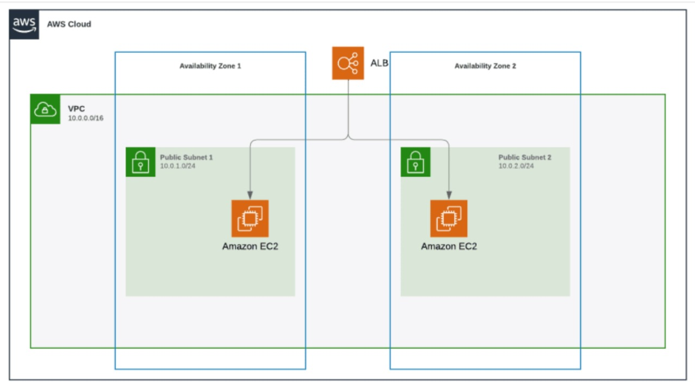

# Terraform Projects

This repository contains Terraform code to deploy and automate AWS infrastructure, featuring a VPC with public subnets and EC2 instances, managed by an Application Load Balancer (ALB). The infrastructure deployment is automated and integrated with a CI/CD pipeline for continuous updates and management.

## Architecture Diagram



## Overview

This project automates the deployment of the following AWS resources:

- A VPC with CIDR block `10.0.0.0/16`
- Two public subnets in different availability zones:
  - Public Subnet 1 (10.0.1.0/24)
  - Public Subnet 2 (10.0.2.0/24)
- EC2 instances in each public subnet
- An Application Load Balancer (ALB) to distribute traffic across the EC2 instances

## Prerequisites

Before you begin, ensure you have the following:

- An AWS account
- AWS CLI configured with your credentials
- Terraform installed on your local machine
- A CI/CD tool (e.g., GitHub Actions, CircleCI) configured for your repository

## Getting Started

### Clone the Repository

```
git clone https://github.com/Jayasurya5454/Terraform_projects.git
cd  ```

### Configure AWS Credentials


Configure AWS Credentials
Ensure you have your AWS credentials configured on your local machine. You can set them up using the AWS CLI:

bash
Copy code
aws configure
Terraform Initialization
Before applying the Terraform configuration, initialize the project:

bash
Copy code
terraform init
Apply Terraform Configuration
Apply the Terraform configuration to deploy the infrastructure on AWS:

bash
Copy code
terraform apply


